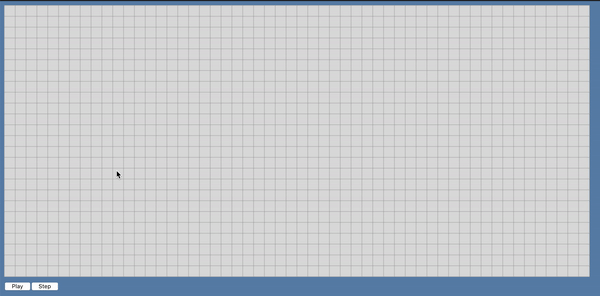

# interactive Game of Life (iGoL)
**Work in progress.**

Interactive [Game of Life](https://en.wikipedia.org/wiki/Conway%27s_Game_of_Life) board.
Turn cells on or off with a click/drag of the mouse, and see how life evolves.

The interactivity is provided by a HTML canvas within a [Vue](https://vuejs.org/) app.

Preview of basic functionality (still a work in progress):


## Project setup
```
npm install
```

### Compiles and hot-reloads for development
```
npm run serve
```

### Compiles and minifies for production
```
npm run build
```

### Lints and fixes files
```
npm run lint
```

### Customize configuration
See [Configuration Reference](https://cli.vuejs.org/config/).
